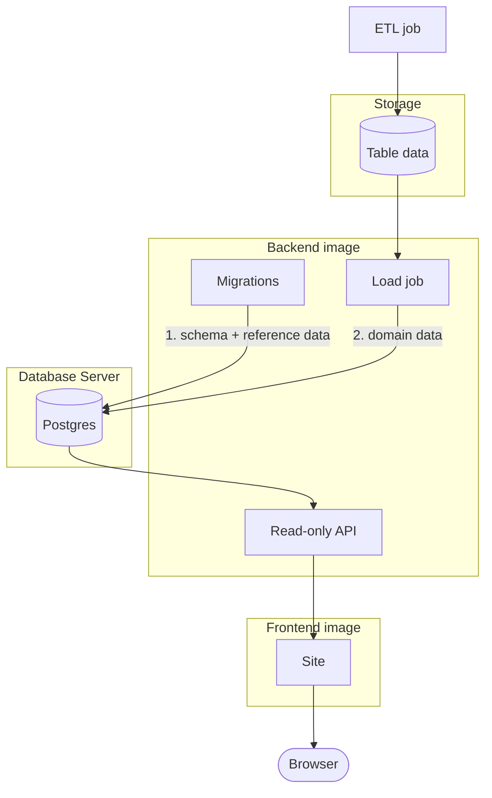

# Chapter 1: Architecture

When designing a fullstack application, the first thing we think about is the end product. What is the end-user going to experience? What do they need to be able to do? From there, we work backward to the backend, which is usually where we start coding--but not where our thinking begins!

This application aims to model WSL data and present data-driven interpretations of each team's performance, in order to help new fans of WSL learn about the league and find a team to support or follow. Maybe the user prefers to support an underdog. Maybe they want to follow the team with their country's best player, ahead of the World Cup. The API should help the user join and aggregate data according to their interests.

## Design Choices

This primary use case and these resource constraints lead to 4 important design choices:

1. **Batch Data**. The data is updated periodically (after matches); it is not real-time. This means a job, such as an Extract Transform Load (ETL) process, can run somewhere outside our application and periodically write data. You could even do it manually. Since we're using a relational database, let's say this external job writes CSV files.

2. **Read/Write Job**. Given the first choice, we'll need a job to read the files and write rows into the Postgres database. This is how the database will stay up to date. The job needs a read/write Postgres role, but it doesn't need to be integrated into the backend API. In fact, it's more secure if we isolate this read/write job in its own running process. We can build it with the backend image, but we'll run it separately and provision its Postgres role via its isolated environment.

3. **Read-Only API**. The load job is the one thing that writes domain data into Postgres, using write-capable credentials from its runtime environment. Thanks to this, the API doesn't _need_ to write to the database, and so we set up its database connection with a read-only role. This means that no API endpoint can alter the database, even if a future endpoint (or a bug) tried to.

4. **Reviewed Migrations**. The read/write load job has no way of knowing the database's schema. This means we need another way to ensure the inserted data is compatible. The database schema is defined in the backend's source code. When the code changes, our dependency Alembic (also Python-based) reads the source code and generates migration scripts, to be reviewed by a human. A human then applies the migration using Alembic commands. As a fallout from this decision, the read/write job needs to fail loudly if a row conflicts with the database schema. This will indicate a developer needs to intervene. Either the input data is wrong, or the database schema is not up to date and needs a migration.

## Diagram

