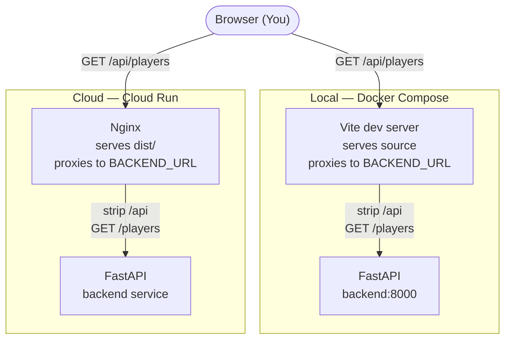

# Chapter 2: Deployment

How do we run this fullstack application?

## Basics

Let's start with the piece that makes the application run on your machine: the [`compose.yaml`](../compose.yaml) file.

It's important to distinguish between [Docker](https://docs.docker.com/build/concepts/dockerfile/), which we use in both development and production, and [Docker Compose](https://docs.docker.com/compose/), which we use only for local runs─though some people use it in production too.

Docker Compose lets us define separate services and then link them together in a virtual network. Look at the [`compose.yaml`](../compose.yaml) file and notice how 3 `services` are defined: `db`, `backend`, and `frontend`.

```yaml
services:
  db:
    image: postgres:18.6-trixie

  backend:
    build:
      context: .
      dockerfile: deploy/Dockerfile.backend
    depends_on:
      db:
        condition: service_healthy

  frontend:
    build:
      context: .
      dockerfile: deploy/Dockerfile.frontend
    depends_on:
      - backend
```

Compose creates three separate containers from three separate images. It then gives us a way to run each as its own container on a shared network, as well as let us control them as one set. The expression `depends_on` in the `compose.yaml` file is Docker Compose's way of helping us orchestrate the separate images.

- To run the backend, the Postgres database must be running *and healthy*. The long form (`condition: service_healthy`) waits for the database's healthcheck to pass, not merely for its container to exist.
- To run the frontend, the backend container must have *started*. The short form (`- backend`) is weaker: it only orders startup and does not wait for the API to be ready to answer. That's fine here, because nothing the frontend does at boot needs the API — the browser calls it later.

To learn more about how these are run individually or together, look at the convenience commands in the developer's [`Justfile`](../Justfile).

### Cloud Orchestration

In the cloud, these 3 aspects are handled by separate services. And it's usually a Dev Op's role to help make sure they're running correctly.

Let's use Google Cloud as an example:

- Postgres database instance: [Cloud SQL](https://cloud.google.com/sql/docs/postgres) server
- Backend's read/write job: [Cloud Run Job](https://docs.cloud.google.com/run/docs/overview/what-is-cloud-run#cloud-run-jobs)
- Backend API: [Cloud Run Service](https://docs.cloud.google.com/run/docs/overview/what-is-cloud-run#cloud_run_services)
- Frontend: [Cloud Run Service](https://docs.cloud.google.com/run/docs/overview/what-is-cloud-run#cloud_run_services)

Additionally, whereas Docker Compose (locally) sets our secrets as environment variables in the containers it runs, the clould services need secrets handled differently because they're in completely different services─maybe even from different providers. In the Google Cloud example, we'd use [Secret Manager](https://cloud.google.com/security/products/secret-manager).

## Backend API v. Frontend Site

When talking deployment, it's also important to understand a fundamental difference between the FastAPI backend and the frontend website.

### The backend is a Python program

The FastAPI router is a program that runs. Locally, you can use Docker Compose to run the container `backend`, but you could also run it directly with `uv` or Python. Remotely, we need a service, like Google's [Cloud Run Service](https://docs.cloud.google.com/run/docs/overview/what-is-cloud-run#cloud_run_services), to run the Python code.

In both cases, we run it with uvicorn, which is a server FastAPI recommends, but you could also configure this to be different between production and development.

However, regarding the uvicorn server, there is one important difference:

**Local**: [`compose.yaml`](../compose.yaml) writes the command to run the program with the flag `--reload`. This means, as you make changes to the FastAPI code, the router reloads and shows your changes in real time. That's helpful while you're developing.

```yaml
  backend:
    build:
      context: .
      dockerfile: deploy/Dockerfile.backend
    command:
      - /app/backend/.venv/bin/uvicorn
      - app.main:app
      - --host
      - 0.0.0.0
      - --port
      - "${BACKEND_PORT:-8000}"
      - --reload
```

**Cloud**: [`Dockerfile.backend`](../deploy/Dockerfile.backend) writes the command without the flag. That's necessary because you want to guarantee what version of the code is in deployment.

```docker
CMD ["sh", "-c", "uvicorn app.main:app --host 0.0.0.0 --port ${PORT:-8000}"]
```

Crucially, both ways of deployment define the port, on which the API listens to requests, from an environment variable. Locally, this is read from your `.env` file and Docker Compose sets it as an environment variable in the container's runtime. In production, you'd set this environment variable directly in the service in which you're running the API program.

### The frontend is a bundle of files

The frontend is different. It's not a program that runs somewhere. It's technically a compilation of files, mostly of HTML, CSS, and JavaScript.

A browser requests and downloads these files when it visits the frontend's access point.

### Serving the Frontend Files

So what compiles the frontend's files? What serves them to the client's browser?

The frontend is built with a web framework called React. How it's bundled and served is where we need to make distinctions between development and production environments.

#### Developer's Server

Locally we use a server called [Vite](https://vite.dev/), a tool for web development. It's different than what we'll use in production. It's designed for us locally to run and test our React app.

Like everything else locally, we deploy this with Docker Compose and our [`compose.yaml`](../compose.yaml) file. And like the backend, we use a [`Dockerfile`](../deploy/Dockerfile.frontend) to standardise everything between development and production.

```yaml
  frontend:
    build:
      context: .
      dockerfile: deploy/Dockerfile.frontend
      target: deps
    command: npm run dev -- --host 0.0.0.0
```

Like the `command` in the `backend` service, the `frontend` service replaces the Dockerfile's command so that it's run a little differently locally than it would be in production. The command `npm run dev` runs our Vite developer's server because of how we scripted the `npm` command in the frontend's [`package.json`](../frontend/package.json) file:

```json
{
  "name": "wsl-frontend",
  "private": true,
  "version": "0.1.0",
  "type": "module",
  "scripts": {
    "dev": "vite",
    "build": "tsc -b && vite build"
  }
}
```

Lastly, when we look again at the [`compose.yaml`](../compose.yaml) file, we should notice 3 more differences in the frontend's local deployment compared to the backend.

1. `target: deps`
2. `./frontend:/app`
3. `frontend-node-modules:/app/node_modules`

```yaml
  frontend:
    build:
      context: .
      dockerfile: deploy/Dockerfile.frontend
      target: deps
    command: npm run dev -- --host 0.0.0.0
    environment:
      PORT: ${FRONTEND_PORT:-5173}
      BACKEND_URL: ${BACKEND_URL:-http://backend:${BACKEND_PORT:-8000}}
    volumes:
      - ./frontend:/app
      - frontend-node-modules:/app/node_modules
```

1. **`target: deps`.** We build from the *same* `Dockerfile.frontend` locally and in production. But, for development, we target the image the file defines as `deps`, named for the fact it only builds Node and the dependencies. Production will build from the same base as `deps`, but will go a step further to compile the files into a static `dist/` directory. Locally, we don't want to do that.

2. **`./frontend:/app`.** This maps our source code into the Docker container, so that when we save a file, the file changes inside the container too. That is what lets Vite notice edits and refresh the browser.

3. **`frontend-node-modules:/app/node_modules`.** This one looks redundant but is essential. The bind mount above replaces everything at `/app` with our host folder — including `node_modules`, which on our host may be missing or built for a different platform. Mounting a separate volume *on top of* `/app/node_modules` protects the copy that was installed inside the image.

#### Production Server

We don't use Vite's server outside a developer's environment. But Vite does one other thing that we will use in production. It compiles the code into a static `dist/` directory of files for the client to download. The frontend's [Dockerfile](../deploy/Dockerfile.frontend) uses this feature when it runs the `npm run build` command we defined in the frontend's [`package.json`](../frontend/package.json) file.

```dockerfile
ARG NODE_VERSION=24

FROM node:${NODE_VERSION}-alpine AS deps
WORKDIR /app
COPY frontend/package.json frontend/package-lock.json ./
RUN npm ci

FROM deps AS build
COPY frontend/ ./
RUN npm run build

FROM nginx:alpine AS serve
ENV NGINX_ENVSUBST_FILTER="^(PORT|BACKEND_URL)$"
COPY deploy/nginx.conf.template /etc/nginx/templates/default.conf.template
COPY --from=build /app/dist /usr/share/nginx/html
```

After building the files, production's Nginx image serves only the files ready for distribution (`dist/`). The final stage (`serve`) starts fresh `FROM nginx:alpine` and copies only the static files across — not our source code, not the `node_modules`, not Node itself.

The big difference between the local/development server and the production one, the big reason we need a [`Dockerfile.frontend`](../deploy/Dockerfile.frontend) that builds multiple images, is because we need the development server to be responsive to changes we make to the frontend code. And we don't want the production server to change. We want it to be reliably static, based on the version of the frontend code built at a specific time.

#### One Dockerfile, three stages

It's tempting to conclude from all this that the frontend lives in two separate worlds: Vite over here for development, Nginx over there for production. But that's not the case.

There is one [`Dockerfile.frontend`](../deploy/Dockerfile.frontend), and both environments build from it:

| Stage | What it contains | Who uses it |
| --- | --- | --- |
| `deps` | Node and the installed dependencies | Compose, for local development |
| `build` | the above, plus source, plus the compiled `dist/` | nobody directly — it only feeds `serve` |
| `serve` | Nginx and `dist/`. No Node at all. | the cloud |

This is the same pattern the backend uses, and it's worth seeing the symmetry:

| | backend | frontend (`deps`) |
| --- | --- | --- |
| the image provides | Python and installed dependencies | Node and installed `node_modules` |
| dev overrides the command | `uvicorn --reload` | `npm run dev` |
| dev mounts live source over it | `./backend/src` | `./frontend` |

When deployed with Docker Compose, both services bake their runtime and dependencies into an image, then mount live source code on top and swap the command the Dockerfile uses.

So why does the frontend need three stages when the backend needs one? Because Python runs our source code directly. TypeScript and React must be *compiled* before a browser can use them — and the thing that serves the compiled output (Nginx) is a different program from the thing that serves it during development (Vite).

## How the frontend reaches the backend

Now that we've explained how the frontend and backend are built and run, it's time to explain how they talk to each other in both types of environment.

A browser loads the site (frontend) from one place and the API (backend) lives somewhere else — so how does the frontend know where to send requests for pages?

The answer is that **it doesn't, and that's deliberate.** The frontend code is deliberately ignorant of where it needs to send requests. Look at how the app fetches player data ([`frontend/src/api/players.ts`](../frontend/src/api/players.ts)):

```ts
const API_BASE = "/api";
const response = await fetch(`${API_BASE}/players`);
```

That is a *relative* path. There's no hostname in it. The browser resolves it against whatever origin served the page, so the request goes right back to the server the site came from. The compiled JavaScript bundle contains no backend address anywhere.

Something then has to forward those `/api` requests to the real API, and that job belongs to whatever is serving the site. The browser's request is identical in both environments — only the thing that answers it changes:



Notice that the top of the diagram is identical on both paths. The app, the request it makes, and the URL it asks for do not know which environment they are in. Everything environment-specific sits in the middle — and both of those middle boxes are configured by the same variable.

Here is each one in code:

**Locally, Vite's dev server forwards them** ([`frontend/vite.config.ts`](../frontend/vite.config.ts)):

```ts
proxy: {
  '/api': {
    target: process.env.BACKEND_URL || 'http://localhost:8000',
    rewrite: (path) => path.replace(/^\/api/, ''),
  },
}
```

**In the cloud, Nginx forwards them** ([`deploy/nginx.conf.template`](../deploy/nginx.conf.template)):

```nginx
location /api/ {
    proxy_pass ${BACKEND_URL}/;
}
```

Both strip the `/api` prefix before forwarding, because our FastAPI routes are mounted at the root — the backend serves `/players`, not `/api/players`. And both read the *same* environment variable, `BACKEND_URL`.

There's a second reason to route everything through one origin rather than letting the browser call `localhost:8000` directly. A page served from port 5173 calling port 8000 is a **cross-origin** request, and browsers block those unless the server explicitly allows it. Proxying through one origin avoids the problem entirely — as far as the browser is concerned, it only ever talks to one server.

## Configuration happens at startup, not at build

We've reached the final section. How do secrets get into the running Docker containers? Who sets the `BACKEND_URL` port and how?

Let's focus on the frontend some more. Because the compiled source files, what's built in `dist/`, only ever say `/api`, they work against any backend configuration. All we need to do is set the environment variable in whatever container they're running in.

For production, nginx supports this directly. We don't give it a finished config — we give it a template ([`deploy/nginx.conf.template`](../deploy/nginx.conf.template)) containing `${PORT}` and `${BACKEND_URL}`. Every time the container starts, Nginx runs `envsubst` over that template and writes out the real config. That's why `Dockerfile.frontend` copies the file to `/etc/nginx/templates/` rather than straight into the config directory.

`NGINX_ENVSUBST_FILTER` tells `envsubst` which variable names it is allowed to replace. The value is treated as a **regular expression matched against variable names**.

The general principle: **push configuration as late as you can.** Decide it at startup, not at compile time, and one artifact serves every environment.
